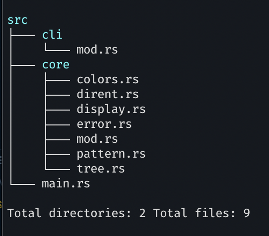

# small-axe

“If you are the big tree, we are the small axe.”

### [WIP] \*nix tree command in Rust

```bash
tree [-adfghilnoprstuCDFN] [-L level] [-P pattern] [-I pattern] [--inodes] [--device] [--noreport] [--dirsfirst] [--help] [directory ...]
```

- Additional flags are under active development



Borrowing iterator logic was heavily inspired by [Walkdir](https://docs.rs/walkdir/latest/walkdir/).
